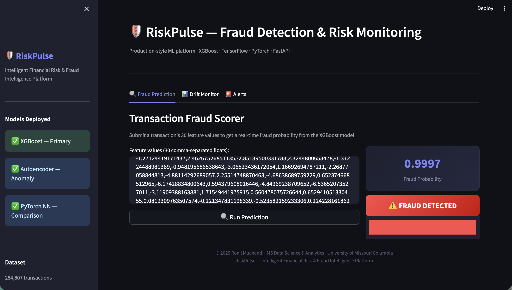
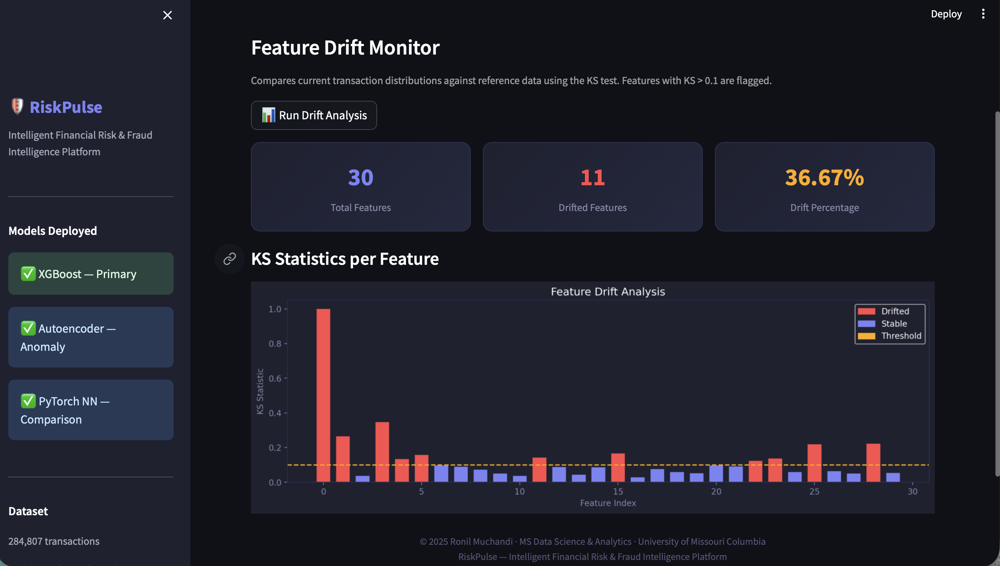

# 🛡️ RiskPulse — Intelligent Financial Risk & Fraud Intelligence Platform

> **"Don't just detect fraud. Monitor your model's health and know when it stops working."**

      

RiskPulse is a production-style fraud detection platform that mirrors how banks like JPMorgan operate machine learning in the real world — not just training models, but deploying them, watching them, and knowing when they need to be retrained.

---

## The Problem

Every time you swipe your credit card, your bank runs that transaction through a machine learning model within milliseconds. It checks if the amount, location, time, and spending pattern look suspicious. If the score is high — your card gets blocked or you get a text.

The hard part is not building that model. It is keeping it working over time.

Fraudsters constantly change tactics. A model trained in January may silently fail by June because the fraud patterns it learned no longer match what is happening in the real world. Most fraud detection projects never address this. RiskPulse does.

---

## What We Built

Three connected systems working together:

**Part A — Fraud Detection Engine**
Three models trained on 284,807 real credit card transactions and compared statistically:
- XGBoost — primary model, fastest and most accurate
- TensorFlow/Keras Autoencoder — catches fraud patterns never seen in training
- PyTorch Neural Network — comparison model

Models were validated using A/B testing and KS hypothesis testing — not just accuracy scores.

**Part B — Data Drift Monitor**
Watches whether the data the model receives today still looks like the data it was trained on. Uses the KS statistical test on all 30 features. When too many features drift, an automated alert fires recommending retraining.

**Part C — Deployment**
- FastAPI REST API with three endpoints: `/predict`, `/drift`, `/alerts`
- Streamlit live dashboard — dark UI, fraud scorer, drift chart, alerts panel
- Docker containerization
- AWS S3 for dataset storage, AWS EC2 for cloud deployment

---

## How It Works in Real Life
```
Transaction comes in
        │
        ▼
API receives 30 feature values
        │
        ▼
XGBoost scores it in milliseconds
        │
   ┌────┴────┐
   ▼         ▼
FRAUD      NORMAL
block      approve
        │
        ▼
Drift monitor checks in background
        │
        ▼
Alert fires if model health degrades
```

---

## Key Results

| Model | ROC-AUC | Avg Precision |
|---|---|---|
| XGBoost | **0.9717** | **0.8214** |
| PyTorch NN | 0.9706 | 0.7608 |
| TF/Keras Autoencoder | 0.9595 | 0.5159 |

KS test confirmed all three models are statistically significantly different (p < 0.0001) — model selection is not arbitrary.

On a real confirmed fraud transaction from the dataset: **fraud probability 0.9997**.

---

## Dataset

Kaggle Credit Card Fraud Detection — 284,807 real anonymized transactions from European cardholders, provided by ULB and Worldline (a real payments company). Features V1–V28 are PCA-transformed real transaction attributes anonymized for privacy. Only 0.17% of transactions are fraud — extreme class imbalance handled using SMOTE applied exclusively on training data.

---

## Dashboard Preview





---

## Tech Stack

`Python 3.9` `XGBoost` `TensorFlow/Keras` `PyTorch` `Scikit-learn` `SMOTE` `SciPy` `FastAPI` `Streamlit` `Docker` `AWS S3` `AWS EC2` `Pandas` `NumPy`

---

## Run Locally
```bash
git clone https://github.com/Ronilmuchandi/Riskpluse.git
cd Riskpluse
python3 -m venv venv
source venv/bin/activate
pip install -r requirements.txt
```

Download the dataset from Kaggle and place at `data/raw/creditcard.csv`, then:
```bash
python3 notebooks/02_preprocessing.py
python3 models/xgboost/train_xgboost.py
python3 models/autoencoder/train_autoencoder.py
python3 models/pytorch/train_pytorch.py
python3 monitoring/drift_detector.py
python3 monitoring/alert_system.py

# Terminal 1
uvicorn api.main:app --reload

# Terminal 2
streamlit run dashboard/app.py
```

Open `http://localhost:8501`

---

## Future Work

- Auto-retraining when drift threshold is exceeded
- Prediction logging to database for audit trail
- JWT authentication on API endpoints
- Real-time streaming via Apache Kafka
- SHAP explainability for individual predictions

---
## Challenges & How We Solved Them

**Class imbalance (0.17% fraud rate)**
Naive models predicted everything as normal and still got 99.8% accuracy. Fixed by applying SMOTE oversampling — but only on training data. Applying it before splitting would have caused data leakage and inflated metrics.

**Autoencoder threshold tuning**
The autoencoder had no natural decision boundary. Solved by setting the fraud threshold at the 95th percentile of reconstruction error on normal transactions — anything above that is flagged as anomaly.

**KS test sensitivity at large scale**
With 284K rows, even tiny natural differences between datasets produced p-values of 0.0000, making every feature appear drifted. Switched from p-value to KS statistic directly — features with KS > 0.1 are flagged as drifted, regardless of p-value.

**AWS EC2 memory limits**
The free tier t3.micro has 1GB RAM. TensorFlow alone requires more than that to install via Docker, causing the build to be killed mid-process. Resolved by running the API directly on the instance without Docker for the free tier, with Docker reserved for production-grade deployment.

**Streamlit Cloud incompatibility**
Initial plan was to deploy the dashboard on Streamlit Community Cloud. Memory and CPU limits made it incompatible with a TensorFlow + XGBoost stack. Switched to a local-run model with a demo recording — a cleaner approach for an ML engineering project.

## Author

**Ronil Muchandi**
MS Data Science & Analytics | University of Missouri Columbia | GPA 3.5
F1 Visa | CPT Eligible | Graduating May 2027

[LinkedIn](https://linkedin.com/in/ronil-muchandi-892602187) · [GitHub](https://github.com/Ronilmuchandi) · [LexiQuery](https://github.com/Ronilmuchandi/lexiquery)